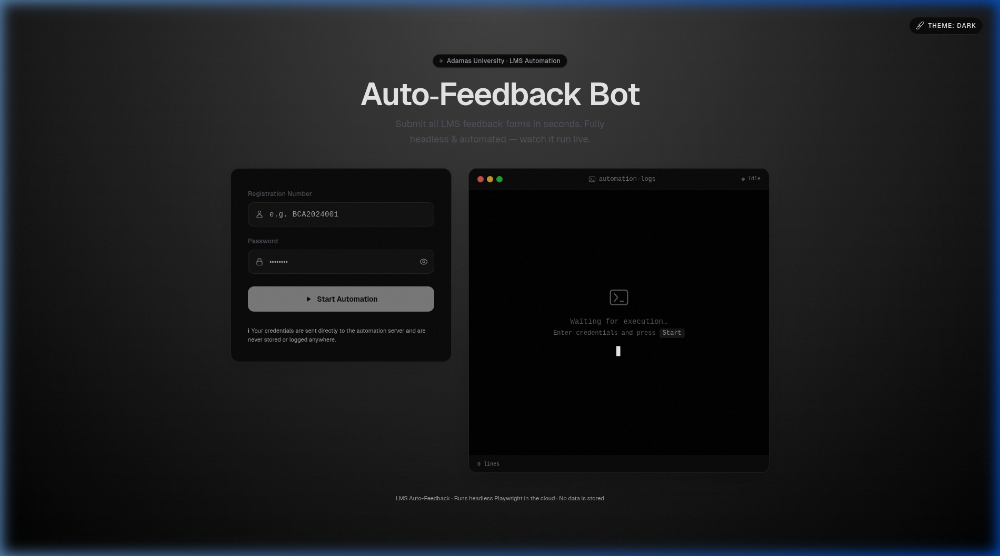
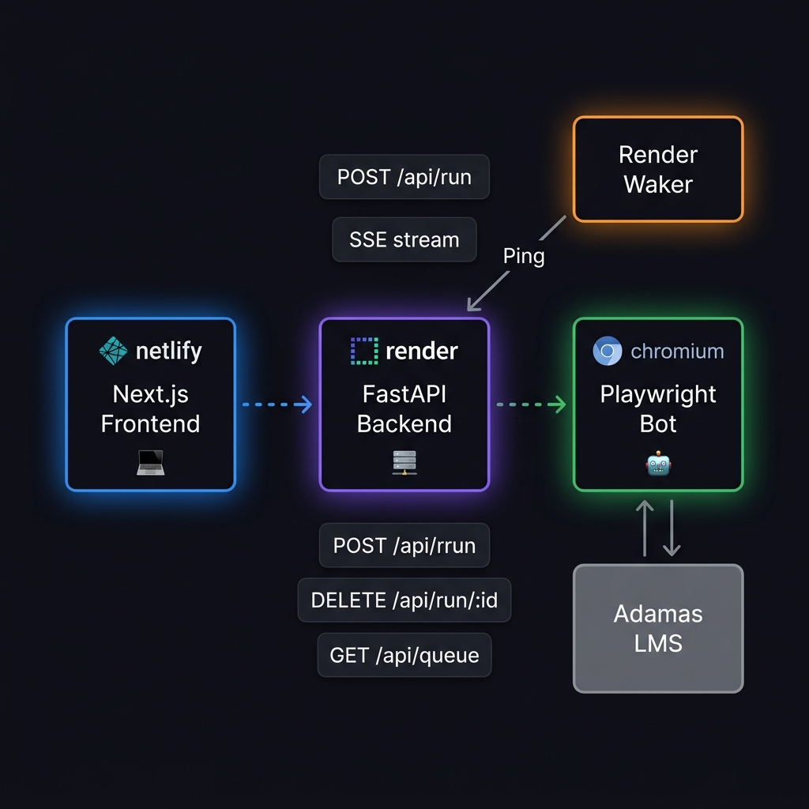

<div align="center">



# 🤖 Adamas Auto-Feedback Bot

**Automatically submit all pending LMS feedback forms in seconds — fully headless, production-ready, and open source.**

[](https://render.com)
[](https://netlify.com)
[](https://python.org)
[](https://nextjs.org)
[](https://fastapi.tiangolo.com)
[](https://playwright.dev)
[](LICENSE)

[**Live Demo**](https://lmsfeedback.netlify.app) · [**Report Bug**](https://github.com/Dheerajkumar69/Collageautomationbot/issues) · [**Request Feature**](https://github.com/Dheerajkumar69/Collageautomationbot/issues)

</div>

---

## ✨ What It Does

The Adamas LMS requires students to manually fill in hundreds of repetitive feedback forms each semester. This bot automates the entire process:

1. 🔐 **Logs in** to your Adamas University student portal
2. 🔍 **Finds** all subjects with pending feedback
3. 📋 **Opens** every feedback form automatically
4. ✅ **Submits** each form — and streams live progress to your browser
5. 📊 **Reports** a summary when done

No manual clicking. No tedious repetition. Just enter your credentials and watch it go.

---

## 🖥️ The Interface

A sleek web dashboard lets any student run the bot from their browser — no terminal required.

| Feature | Description |
|---|---|
| 🟢 **Live Terminal** | Real-time log streaming via Server-Sent Events (SSE) |
| 👥 **Live Queue** | See who else is running and your estimated wait time |
| 🎨 **4 Themes** | Dark · Light · Cat · Synthwave |
| 🛑 **Stop Button** | Cancels both frontend stream and server-side process |
| 🔒 **Secure** | Credentials are never stored — only used per-request |

---

## 🏗️ Architecture

<div align="center">

</div>

```
User Browser (Netlify)
    │  POST /api/run  (credentials in JSON body)
    │  ← SSE stream (live logs)
    │  GET /api/queue  (live queue polling every 3s)
    ▼
FastAPI Server (Render)
    │  spawns subprocess per request
    │  manages async queue (max 5 concurrent)
    ▼
Playwright Bot (Chromium, headless)
    │  logs in → navigates → submits forms
    ▼
Adamas LMS (adamasknowledgecity.ac.in)

Render Waker (separate Render worker)
    → pings /health every 10 min to prevent cold-starts
```

### Tech Stack

| Layer | Technology | Hosted On |
|---|---|---|
| Frontend | Next.js 15 + TypeScript + Tailwind | Netlify |
| Backend API | FastAPI + Python 3.11 + uvicorn | Render (free) |
| Browser automation | Playwright + Chromium (headless) | Render (free) |
| Keep-alive | Custom waker script | Render (worker, free) |

---

## 🚀 Quick Start — Web (Hosted)

> Just visit the live frontend — no setup needed!

1. Go to **[lmsfeedback.netlify.app](https://lmsfeedback.netlify.app)**
2. Enter your **Registration Number** (e.g. `AU/2025/0001234`)
3. Enter your **LMS password**
4. Hit **Start Automation** and watch the terminal stream live

> ⚠️ The backend runs on Render's **free tier** — the first request may take 30–60s to cold-start. A waker service runs in the background to minimize this.

---

## 💻 Local Setup (Self-Hosted)

### Prerequisites

- Python **3.11+**
- Node.js **18+**
- Git

### 1. Clone

```bash
git clone https://github.com/Dheerajkumar69/Collageautomationbot.git
cd Collageautomationbot
```

### 2. Python Backend

```bash
# Create virtual environment
python3 -m venv .venv
source .venv/bin/activate      # Windows: .venv\Scripts\activate

# Install dependencies
pip install -r requirements.txt

# Install Chromium
playwright install chromium

# Start the API server
uvicorn server:app --host 0.0.0.0 --port 8000 --reload
```

### 3. Next.js Frontend

```bash
# In a second terminal
npm install

# Set backend URL
echo "NEXT_PUBLIC_API_URL=http://localhost:8000" > .env.local

# Start dev server
npm run dev
```

Open **[http://localhost:3000](http://localhost:3000)** — done!

### 4. (Optional) CLI Mode — No Frontend Needed

```bash
source .venv/bin/activate

# Prompted mode (interactive)
python3 main.py

# With .env file (no prompts)
cp .env.example .env
# Edit .env: set LMS_USERNAME and LMS_PASSWORD
python3 main.py

# Dry run (navigates but does NOT submit)
python3 main.py --dry-run

# Headful mode (see the browser window)
python3 main.py --headful
```

---

## ☁️ Deploy Your Own

### Backend → Render

1. Fork this repo
2. Create a new **Web Service** on [render.com](https://render.com)
3. Connect your fork
4. Render auto-reads `render.yaml` — no manual config needed
5. Set any secret env vars in the Render dashboard

> The `render.yaml` file already includes the Playwright Chromium install step and the waker worker.

### Frontend → Netlify

1. Create a new site on [netlify.com](https://netlify.com)
2. Connect your fork
3. Set env var: `NEXT_PUBLIC_API_URL=https://your-render-service.onrender.com`
4. Deploy — `netlify.toml` handles the build config

---

## ⚙️ Environment Variables

### Backend (Render / local)

| Variable | Default | Description |
|---|---|---|
| `RUN_QUEUE_MAX_DEPTH` | `5` | Max concurrent requests in queue |
| `RUN_QUEUE_HEARTBEAT_SECONDS` | `5` | Queue polling interval |
| `RUN_STREAM_HEARTBEAT_SECONDS` | `15` | SSE keepalive interval |
| `BOT_ETA_SECONDS` | `90` | Estimated seconds per automation run |
| `BOT_HEADFUL` | `0` | Set to `1` to launch visible browser (local only) |
| `BOT_DRY_RUN` | `0` | Set to `1` to skip form submission |
| `BOT_TIMEZONE` | `Asia/Kolkata` | Timezone for the bot process |

### Frontend (Netlify / local)

| Variable | Description |
|---|---|
| `NEXT_PUBLIC_API_URL` | Full URL of your FastAPI backend |

---

## 📁 Project Structure

```
Collageautomationbot/
├── bot/                    # Python automation engine
│   ├── config.py           # Config dataclass (reads env vars)
│   ├── auth.py             # Login + student name extraction
│   ├── browser.py          # Playwright browser manager
│   ├── navigation.py       # Navigate to feedback section
│   ├── feedback.py         # Subject iteration + form submission
│   ├── selectors.py        # All CSS/XPath selectors
│   ├── utils.py            # Retry decorator, error artifacts
│   └── logger.py           # Structured logging
├── src/app/                # Next.js 15 App Router frontend
│   └── page.tsx            # Main UI (single page)
├── server.py               # FastAPI app + SSE streaming + queue
├── main.py                 # CLI entry point
├── render_waker.py         # Keep-alive pinger for Render free tier
├── render.yaml             # Render deploy config (web + worker)
├── netlify.toml            # Netlify deploy config
├── .env.example            # Template — copy to .env for local use
└── requirements.txt        # Python dependencies
```

---

## 🔒 Security & Privacy

> **Your credentials are handled with care:**

- ✅ Credentials are **never stored** on the server — only held in memory for the duration of the request
- ✅ All log output is **sanitized** — passwords and tokens are redacted before streaming to your browser
- ✅ The server passes credentials to the bot via **environment variables** (not command-line args)
- ✅ CORS is configured to reject credentials cookies — auth is JSON-body only
- ✅ The `.env` file is gitignored — your local credentials stay local
- ⚠️ This bot is for **personal/educational use** — use your own credentials only

---

## 📈 Performance

| Operation | Typical Time |
|---|---|
| Login | 5–10 s |
| Navigate to Feedback | 2–3 s |
| Submit one feedback form | 2–3 s |
| **50 pending forms** | **~5–8 min** |

Actual times depend on LMS server load and Render cold-start status.

---

## 🛠️ Troubleshooting

<details>
<summary><strong>Backend cold-starting (60s+ wait on first request)</strong></summary>

This is normal on Render's free tier. The waker service pings the backend every 10 minutes to keep it alive, but after deployments or overnight idle periods you may see a one-time delay. Just wait — the frontend will show a "cold-starting" warning.

</details>

<details>
<summary><strong>Login fails with correct credentials</strong></summary>

1. Try headful mode locally to see what the bot sees:
   ```bash
   python3 main.py --headful --dry-run
   ```
2. The LMS login page selectors may have changed. Update `bot/selectors.py`.
3. Check `errors/` folder for HTML dumps saved on failure.

</details>

<details>
<summary><strong>"No subjects found" / "No pending feedback"</strong></summary>

You may have already submitted all feedbacks, or the semester's feedback window hasn't opened yet. Log in manually to verify.

</details>

<details>
<summary><strong>Playwright / Chromium install issues</strong></summary>

```bash
# Re-install Chromium
playwright install chromium

# On Linux, may also need system deps:
playwright install-deps chromium
```

</details>

<details>
<summary><strong>CORS errors in browser console</strong></summary>

Make sure `NEXT_PUBLIC_API_URL` points to your actual backend URL (no trailing slash). The backend's CORS policy allows all origins, so this is always a misconfigured env var.

</details>

---

## 🤝 Contributing

Contributions are welcome! Here's how:

1. **Fork** the repo
2. Create a feature branch: `git checkout -b feat/your-feature`
3. Make your changes
4. Run the mock tests: `python3 test_mock.py`
5. **Commit**: `git commit -m "feat: your feature"`
6. **Push**: `git push origin feat/your-feature`
7. Open a **Pull Request**

### Areas that need help

- [ ] Support for other Adamas LMS versions / portals
- [ ] Retry logic for individual failed form submissions
- [ ] Email/notification on completion
- [ ] Docker / docker-compose setup for easier local deployment

---

## 📜 License

MIT License — see [LICENSE](LICENSE) for details.

You are free to use, modify, and distribute this project. If you self-host, please be a responsible user: only automate your own account.

---

## ⚠️ Disclaimer

This project is an independent student tool and is **not affiliated with, endorsed by, or connected to Adamas University** in any way. Use it responsibly and in accordance with your institution's policies.

---

<div align="center">

Made with ❤️ by [Dheeraj Kumar](https://github.com/Dheerajkumar69)

**⭐ Star this repo if it saved you time!**

</div>
